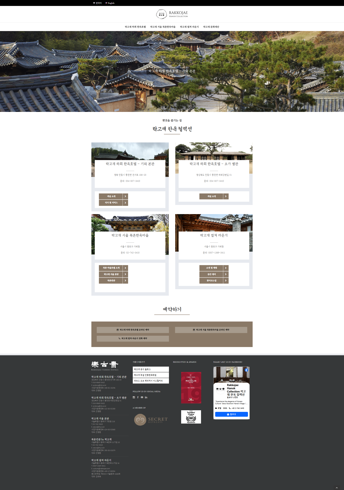
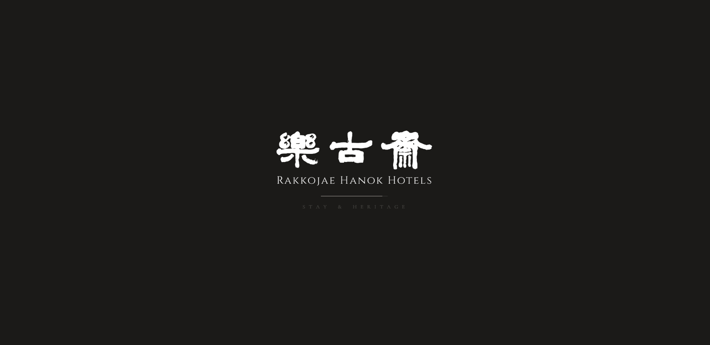
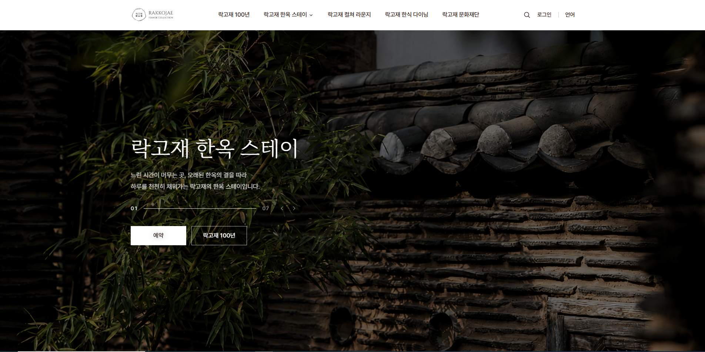
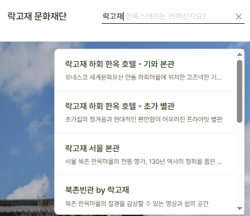
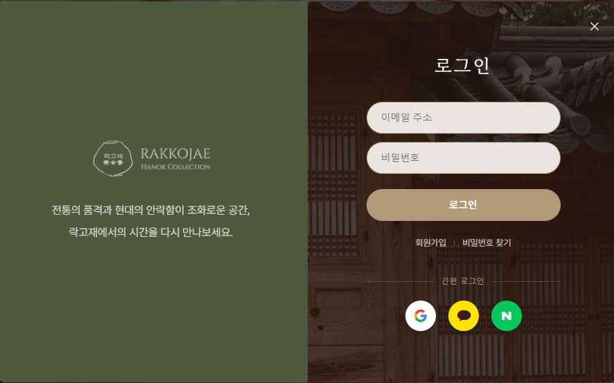
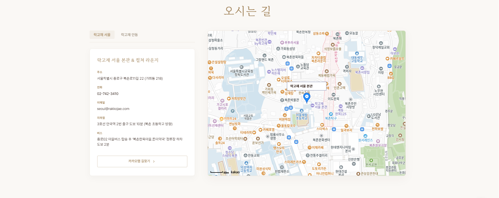
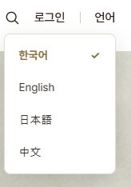

# 🏯 락고재 한옥 스테이 리뉴얼

> 과거와 현대의 조화를 담은 락고재 공식 웹사이트 리뉴얼 프로젝트

[](https://sonwoosuk.github.io/rrak)
[](https://developer.mozilla.org/ko/docs/Web/HTML)
[](https://developer.mozilla.org/ko/docs/Web/CSS)
[](https://developer.mozilla.org/ko/docs/Web/JavaScript)

---

## 📌 프로젝트 소개

<!-- 한두 줄로 프로젝트가 무엇인지, 왜 만들었는지 설명 -->

빌드 도구 없이 **HTML / CSS / Vanilla JS**만으로 제작한 락고재 한옥 스테이 공식 웹사이트 리뉴얼입니다.  
전통 한옥의 감성을 현대적인 UI로 표현하고, Firebase와 Kakao Maps API를 연동해 실제 서비스 수준의 기능을 구현했습니다.

**→ [sonwoosuk.github.io/rrak](https://sonwoosuk.github.io/rrak)**

---

## 🖼️ Before / After

<!-- 리뉴얼 전후 비교 이미지. 없으면 메인 스크린샷으로 대체 -->

| Before | After |
|:---:|:---:|
|  |  |
| 기존 사이트 | 리뉴얼 사이트 |

---

## ⚠️ 주의사항

<!-- 프로젝트 사용·열람 시 주의할 점 -->

- Firebase API 키는 환경 변수로 관리합니다. 직접 실행 시 `firebase-config.js`에 본인 키를 입력하세요.
- Kakao Maps API는 도메인 등록이 필요합니다. 로컬 실행 시 지도가 표시되지 않을 수 있습니다.
- 이 프로젝트는 포트폴리오 목적의 리뉴얼 작업물이며, 실제 락고재와 무관합니다.

---

## 📋 프로젝트 정보

<!-- 팀 프로젝트라면 팀원별로 행 추가 -->

| 항목 | 내용 |
|:---:|:---|
| 담당 역할 | 기획 / 디자인 / 퍼블리싱 / 기능 구현 |
| 작업 기간 | 2025.xx ~ 2025.xx (x주) |
| 기여도 | 100% (개인 프로젝트) |

---

## 🛠️ 기술 스택

<!-- 사용한 기술을 레이어별로 분류 -->

**Frontend**


**Backend / 서비스**


**배포**


| 기술 | 용도 |
|:---|:---|
| Firebase Authentication | Google 소셜 로그인 |
| Firebase Firestore | 예약 내역 저장 및 조회 |
| Kakao Maps JavaScript API | 지점별 위치 안내 지도 |

---

## 🤖 AI 활용

### 사용한 AI 도구

<!-- 사용한 AI 도구 목록 -->

- Claude (Anthropic)

### AI 활용 내용

<!-- AI로 생성하거나 도움받은 부분 -->

- [ ] 코드 리뷰 및 버그 디버깅
- [ ] 반응형 레이아웃 CSS 초안 생성
- [ ] 번역 (한/영 다국어 텍스트)

### 직접 구현한 내용

<!-- AI 없이 직접 설계·구현한 핵심 로직 -->

- [ ] 전체 UI/UX 기획 및 디자인
- [ ] Firebase 연동 예약 저장 로직
- [ ] 커스텀 슬라이더 및 인터랙션

---

## 🔗 프로젝트 링크

<!-- 관련 링크 모음 -->

| 구분 | 링크 |
|:---|:---|
| 배포 사이트 | [sonwoosuk.github.io/rrak](https://sonwoosuk.github.io/rrak) |
| GitHub | [github.com/Sonwoosuk/rakk](https://github.com/Sonwoosuk/rakk) |
| 기획서 / 노션 | — |
| 디자인 (Figma) | — |

---

## 📖 프로젝트 개요

<!-- 기획 배경, 목표, 타겟 사용자를 간략히 서술 -->

락고재는 100년 역사를 가진 전통 한옥 스테이입니다.  
기존 사이트의 노후화된 디자인을 개선하고, 브랜드 감성에 맞는 고급스러운 UI를 구현하는 것을 목표로 했습니다.

- **목표**: 전통과 현대의 조화를 담은 브랜드 사이트 리뉴얼
- **타겟**: 전통 문화 체험에 관심 있는 국내외 여행객
- **핵심 가치**: 고급스러움 · 전통 · 접근성

---

## ✨ 주요 기능

<table>
  <tr>
    <td align="center"><br><b>히어로 이미지 자동 슬라이드</b></td>
    <td align="center"><br><b>헤더 키워드 검색</b></td>
    <td align="center"><br><b>Google 로그인</b></td>
  </tr>
  <tr>
    <td align="center"><br><b>카카오맵 지점 안내</b></td>
    <td align="center"><br><b>언어 전환 (한/영)</b></td>
    <td align="center"></td>
  </tr>
</table>

---

## 🔧 핵심 구현 내용

<!-- 기술적으로 공들인 부분을 구체적으로 작성 -->

**1. 자동 슬라이더 (히어로 섹션)**

```javascript
// 예시: 핵심 로직 발췌
// 실제 코드는 script.js 참고
function autoSlide() {
  currentIndex = (currentIndex + 1) % slides.length;
  goToSlide(currentIndex);
}
setInterval(autoSlide, 4000);
```

**2. 한/영 언어 전환**

- `data-ko` / `data-en` 속성으로 텍스트를 관리하고, `translate.js`에서 일괄 교체
- `localStorage`로 선택 언어 유지

**3. Firebase 예약 저장**

- Firestore 컬렉션 구조: `reservations/{uid}/bookings/{docId}`
- 로그인 상태에서만 저장 허용, 마이페이지에서 목록 조회

---

## 🚧 Trouble Shooting

<!-- 개발 중 마주친 문제와 해결 과정 -->

| 문제 | 원인 | 해결 |
|:---|:---|:---|
| 카카오맵 로드 실패 | 도메인 미등록 | Kakao Developers에서 `localhost` 및 배포 도메인 등록 |
| 로그인 후 UI 미갱신 | `onAuthStateChanged` 누락 | 인증 상태 변경 시 헤더 UI 업데이트 로직 추가 |
| 모바일 슬라이더 터치 오작동 | `touchstart` 이벤트 없음 | `touchstart` / `touchend` 이벤트 핸들러 추가 |

---

## ⚡ 성능 최적화

<!-- 성능 개선 작업 내용과 수치 -->

- [ ] 이미지 `loading="lazy"` 적용으로 초기 로드 시간 단축
- [ ] CSS 변수(`root.css`) 통합으로 중복 스타일 제거
- [ ] 공통 스크립트 분리(`script.js`)로 코드 재사용성 향상

| 항목 | 개선 전 | 개선 후 |
|:---:|:---:|:---:|
| Lighthouse Performance | — | — |
| First Contentful Paint | — | — |

---

## 🗂️ 데이터 구조

<!-- Firestore, localStorage 등 데이터 스키마 -->

**Firestore — 예약 데이터**

```json
{
  "uid": "firebase_user_uid",
  "name": "홍길동",
  "room": "기와본관",
  "checkIn": "2025-08-01",
  "checkOut": "2025-08-03",
  "guests": 2,
  "createdAt": "timestamp"
}
```

**localStorage — 언어 설정**

```
key: "lang"
value: "ko" | "en"
```

---

## 📁 프로젝트 구조

```
rrak/
├── index.html            # 메인 홈
├── history.html          # 락고재 100년
├── kiwa.html             # 기와본관
├── choga.html            # 초가별관
├── seoul.html            # 서울 본관
├── bukchon.html          # 북촌빈관
├── service.html          # 머무름을 위한 배려
├── culture.html          # 컬쳐 라운지
├── dining.html           # 한식 다이닝
│
├── style.css             # 전역 스타일
├── root.css              # CSS 변수 (컬러·타이포)
├── reservation.css       # 예약 UI 스타일
├── [page].css            # 페이지별 스타일
│
├── script.js             # 공통 스크립트
├── firebase-config.js    # Firebase 초기화
├── kakao-maps.js         # 카카오맵
├── login.js              # 인증·로그인
├── mypage.js             # 마이페이지
├── booking-save.js       # 예약 저장
├── search.js             # 검색
├── translate.js          # 언어 전환
├── [page].js             # 페이지별 스크립트
│
└── images/               # 이미지 에셋
```

---

## 🚀 실행 방법

별도 설치 없이 `index.html`을 브라우저에서 바로 열면 됩니다.

**권장: VS Code Live Server**

```bash
# 1. 레포지토리 클론
git clone https://github.com/Sonwoosuk/rakk.git

# 2. VS Code로 열기
code rakk

# 3. Live Server 확장 설치 후 index.html에서 "Open with Live Server" 클릭
```

> Firebase · Kakao Maps 기능은 API 키 설정 없이는 동작하지 않습니다. ⚠️

---

## 📝 개선 예정

<!-- 앞으로 추가하거나 개선할 기능 목록 -->

- [ ] 예약 캘린더 UI 개선 (날짜 선택 UX)
- [ ] 다크모드 지원
- [ ] SEO 메타태그 최적화
- [ ] 접근성 (a11y) 개선

---

## 💡 프로젝트를 통해 배운 점

<!-- 기술적으로 새롭게 알게 된 점, 성장한 부분 -->

- Firebase Authentication의 `onAuthStateChanged` 패턴으로 인증 상태를 일관되게 관리하는 방법
- `data-*` 속성을 활용한 다국어 처리의 구조적 접근법
- 빌드 도구 없이 모듈화를 유지하는 파일 분리 전략

---

## 🪞 프로젝트 회고

<!-- 잘된 점, 아쉬운 점, 다음에 시도할 것 -->

**잘된 점**
- 빌드 없이도 기능과 구조를 체계적으로 분리하여 유지보수성을 높임
- 실제 서비스에 준하는 인증·예약 플로우 구현

**아쉬운 점**
- 초기 설계 없이 진행해 CSS가 점차 복잡해짐
- 반응형 대응이 일부 페이지에서 미흡

**다음에 시도할 것**
- 컴포넌트 기반 프레임워크(React 등)로 동일 프로젝트 재구현
- 디자인 시스템 선정 후 개발 시작

---

## 📄 License

This project is for portfolio purposes only.  
All brand assets and content related to 락고재 belong to their respective owners.

<!-- 오픈소스로 공개할 경우 아래 라이선스 뱃지 사용 -->
<!-- [](LICENSE) -->
